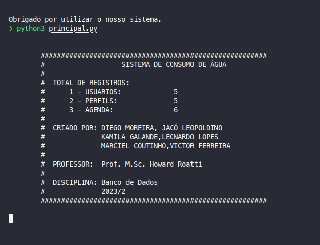
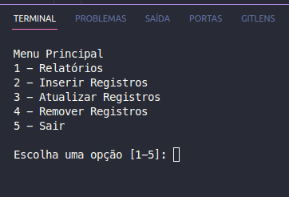
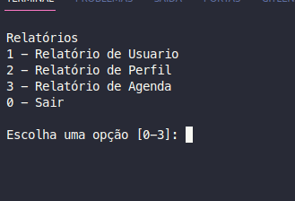
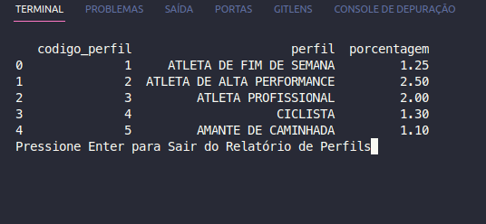
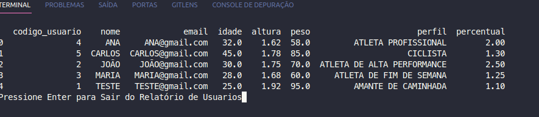
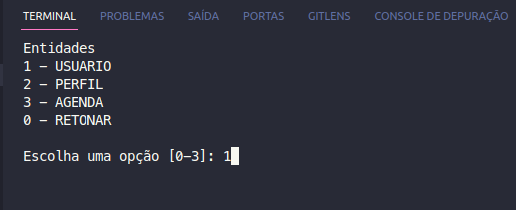
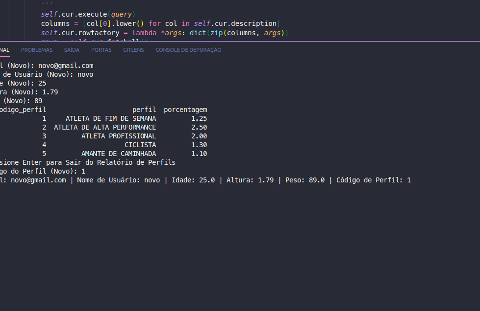
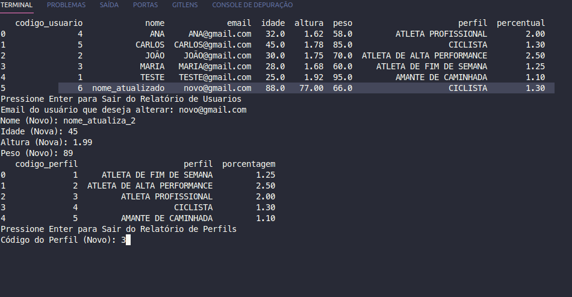
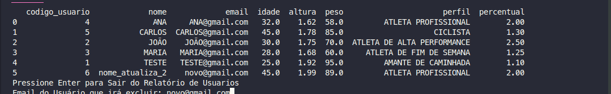

## Aplicativo de Monitoramento de Hidratação

O Aplicativo de Monitoramento de Hidratação é uma ferramenta projetada para ajudar os usuários a acompanhar e atender às suas necessidades diárias de consumo de água de forma personalizada.

### Como Funciona

1. **Perfil do Usuário**: Ao iniciar o aplicativo, você será solicitado a fornecer informações básicas, como peso, altura e idade. Com base nessas informações, o aplicativo calculará a quantidade ideal de água que você deve ingerir diariamente.
2. **Atividade Física**: O aplicativo levará em consideração seu nível de atividade física. Se você for um atleta, corredor, caminhante ou praticante de esportes, o aplicativo ajustará a quantidade de água necessária com base em seu perfil esportivo.
3. **Defina seus Lembretes**: Você pode configurar lembretes personalizados para beber água ao longo do dia. Escolha os horários que melhor se adequam à sua rotina e o aplicativo o notificará para beber a quantidade recomendada nesses momentos.
4. **Aviso de Cumprimento**: O aplicativo o manterá informado sobre seu progresso. Quando você atingir a quantidade recomendada de água para o dia, as notificações de lembrete serão suspensas, permitindo que você mantenha o controle por conta própria.

### Benefícios

- **Hidratação Adequada**: Mantenha-se hidratado e atinja seus objetivos diários de consumo de água.
- **Personalização**: O aplicativo adapta as metas de hidratação com base em suas características pessoais e nível de atividade.
- **Lembretes Amigáveis**: Evite a desidratação com lembretes suaves e customizáveis.
- **Acompanhamento Simples**: Observe seu progresso e alcance sua meta de hidratação diária.

Comece a utilizar o Aplicativo de Monitoramento de Hidratação hoje e cuide melhor da sua saúde através da hidratação adequada.

## Requisitos

- Python 3.x
- Bibliotecas Python listadas em [requirements.txt](src/requirements.txt)

## Instruções de Uso

1. Clone ou faça o download deste repositório em sua máquina.

2. Navegue até o diretório `src`:

   ```shell
   cd src
   ```

3. Instale as bibliotecas Python necessárias:

   ```shell
   pip install -r requirements.txt
   ```

4. 
Testando conexão com banco de dados:

   ```shell
   python3 test.py
   ```

   Certifique-se de que o Oracle Instant Client esteja instalado e configurado corretamente, pois o aplicativo se conecta ao banco de dados Oracle.


5. Crie as tabelas e registros fictícios executando o script `create_tables_and_records.py`:

   ```shell
   python create_tables_and_records.py
   ```

   Certifique-se de que o Oracle Instant Client esteja instalado e configurado corretamente, pois o aplicativo se conecta ao banco de dados Oracle.

6. Agora você pode executar o aplicativo principal:

   ```shell
   python principal.py
   ```

7. Siga as instruções no aplicativo para inserir suas informações pessoais.

7. O aplicativo calculará a quantidade de água que você deve beber diariamente com base no seu peso e mostrará o resultado.

## Organização do Código

- `src/conexion`: Módulo de conexão com o banco de dados Oracle.
- `src/controller`: Classes controladoras para inserção, atualização e exclusão de registros.
- `src/model`: Classes que representam as entidades do aplicativo.
- `src/reports`: Classes responsáveis por gerar relatórios.
- `src/utils`: Scripts de configuração e tela de informações iniciais.
- `src/create_tables_and_records.py`: Script para criar as tabelas e registros fictícios.
- `src/principal.py`: Aplicativo principal que interage com o usuário.

- [diagrams](diagrams): Nesse diretório está o [diagrama relacional](diagrams/diagrama.png) (lógico) do sistema.
    * O sistema possui tres entidades: USUARIO, PERFIL, AGENDA
- [sql](sql): Nesse diretório estão os scripts para criação das tabelas e inserção de dados fictícios para testes do sistema
    * Certifique-se de que o usuário do banco possui todos os privilégios antes de executar os scripts de criação, caso ocorra erro, execute o comando a seguir com o superusuário via SQL Developer: `GRANT ALL PRIVILEGES TO LABDATABASE;`
    * [create_tables_pedidos.sql](sql/create_tables_pedidos.sql): script responsável pela criação das tabelas, relacionamentos e criação de permissão no esquema LabDatabase.
    * [inserting_samples_records.sql](sql/inserting_samples_records.sql): script responsável pela inserção dos registros fictícios para testes do sistema.
## Observações

Certifique-se de que o Oracle Instant Client esteja instalado e configurado corretamente. Se você encontrar problemas relacionados à senha expirada, siga as instruções fornecidas no README para alterar a senha.

Este aplicativo é um exemplo simples e pode ser estendido para incluir recursos adicionais, como armazenamento de dados do usuário, histórico de consumo de água e muito mais.

## Bibliotecas Utilizadas

As bibliotecas Python necessárias estão listadas no arquivo [requirements.txt](src/requirements.txt). Você pode instalá-las com o comando `pip install -r requirements.txt`.

### Instalando Oracle InstantClient
- Baixe a versão do [InstantClient](https://www.oracle.com/database/technologies/instant-client/linux-x86-64-downloads.html) de acordo com a versão do Banco de Dados
- Caso esteja utilizando uma distribuição Linux baseado em Debian, será necessário executar o comando a seguir para converter o arquivo .rpm para .deb.
  ```shell
  sudo alien --scripts oracle-instantclient18.5-basic-18.5.0.0.0-3.x86_64.rpm
  ```
- Descompacte o arquivo e será gerado um diretório em um diretório de fácil acesso.
- Mova os diretórios lib e share para dentro do diretório do InstantClient
  ```shell
  sudo mv lib /usr/local/oracle/instantclient_18_5/
  ```
  
  ```shell
  sudo mv share instantclient_18_5/
  ```
- Edite o arquivo `.bash_profile` incluindo as linhas a seguir ao final do arquivo:
  ```shell
  export ORACLE_HOME=/usr/local/oracle/instantclient_18_5/lib/oracle/18.5/client64
  export LD_LIBRARY_PATH=$ORACLE_HOME/lib
  export PATH=$PATH:$ORACLE_HOME/bin
  export PATH
  ```
  #### Em caso de problemas com a execução dos software dando a seguinte mensagem `ORA-28001: the password has expired`, execute as linhas de comando a seguir no Oracle:
- `ALTER PROFILE DEFAULT LIMIT PASSWORD_LIFE_TIME UNLIMITED;`
- `ALTER USER labdatabase IDENTIFIED BY "labDatabase2022";`
- `ALTER USER labdatabase IDENTIFIED BY  "labDatabase2022";`
## Utilizando Aplicativo
1.  ### Pagina de boas Vindas



---
2.  ### Pagina Principal 

  ```shell
  Onde o usuario verificar os relatórios,iniserir atualizar e deletar os registros
  ```




---
3. ### Pagina de relatórios


  ```shell
  Onde o usuario verificar os relatórios de usuario, perfil e agendados
  ```



   - ####  Relatório de perfil
   

   - ####  Relatório de usuário
   

---

4. ### Pagina de novos registros


  ```shell
  Onde o usuário vai cadastra novos registro usuário, perfil e agenda 
  ```



 - ####  Novo usuario
   
---

5. ### Pagina de atualização registros

 ```shell
  Onde  vai ser atualizado os dados de  usuário, perfil e agenda 
  ```



---
6. ### Pagina de remoção de registros

 ```shell
  Onde  vai ser excluido os dados de  usuário, perfil e agenda 
  ```



## Relatório de participação no desenvolvimento do aplicativo

**Criação do Banco de Dados:**

- Camila e Maciel são os responsáveis pelo desenvolvimento do script das classes e pelo diagrama.

**Desenvolvimento de Telas:**

- Jacó e Diego estão encarregados da criação das telas e da realização dos testes.

**Criação das Classes Model:**

- Vitor assumiu a responsabilidade pelo desenvolvimento das classes model, onde os dados são salvos.

**Controle de Conexão com o Banco de Dados:**

- Leonardo é encarregado das classes de controle de conexão com o banco de dados.

**Readme e Git:**

- Leonardo também está encarregado da criação e edição do readme no GitHub e da disponibilização do aplicativo no repositório do GitHub.

Dessa forma, cada membro da equipe tem tarefas específicas e bem definidas para o projeto.